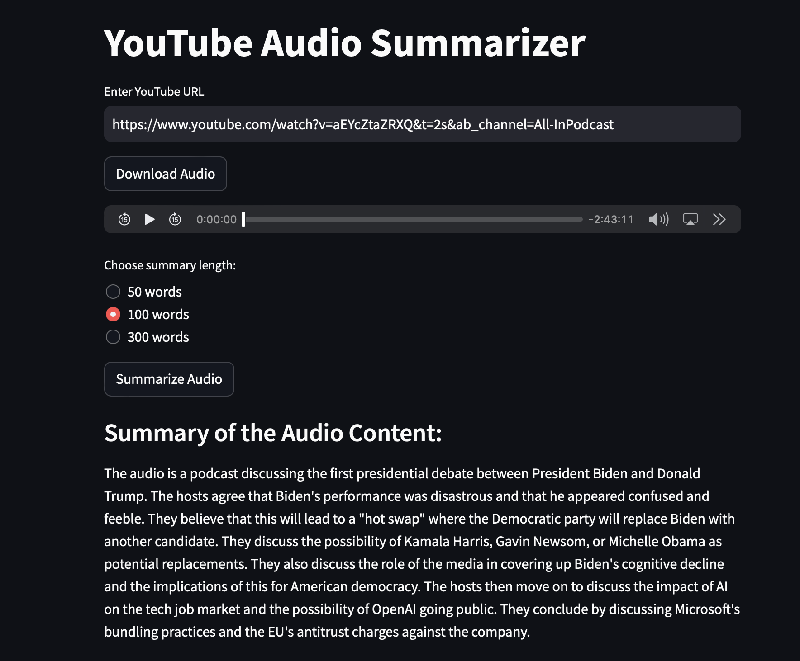

# YouTube Audio Summarizer

This Streamlit application allows users to summarize YouTube videos. By providing a YouTube URL, the application downloads the audio from the video, and then uses Gemini to create a summary of the audio content.



## Applications

- Audio Insights and Analytics
- Podcast & Video Summaries
- Market Research
- News Summarization

## Features

- Download audio from YouTube videos
- Summarize the audio content in different lengths (50 words, 100 words, 300 words)
- Simple and intuitive user interface

## Installation and Setup

### Prerequisites

- Python 3.11 or higher
- pip (Python package installer)
- Gemini API key

### Creating a Python Virtual Environment

1. **Open your terminal or command prompt**.

2. **Navigate to your project directory** (or create one if it doesn't exist):
    ```sh
    mkdir youtube-audio-summarizer
    cd youtube-audio-summarizer
    ```

3. **Create a virtual environment**:
    ```sh
    python -m venv venv
    ```

4. **Activate the virtual environment**:
    - **On Windows**:
        ```sh
        venv\Scripts\activate
        ```
    - **On macOS and Linux**:
        ```sh
        source venv/bin/activate
        ```

### Installing Dependencies

Once the virtual environment is activated, install the necessary packages using `pip`:
```sh
pip install -r requirements.txt
```

### Setting Up the Gemini API Key

1. Obtain your GEMINI API key.
2. **Set the environment variable `GEMINI_API_KEY` with your API key**:
    - **On Windows**:
        ```sh
        set GEMINI_API_KEY=your_api_key_here
        ```
    - **On macOS and Linux**:
        ```sh
        export GEMINI_API_KEY=your_api_key_here
        ```

### Run the App

To run the Streamlit application, execute the following command:
```sh
streamlit run main.py
```